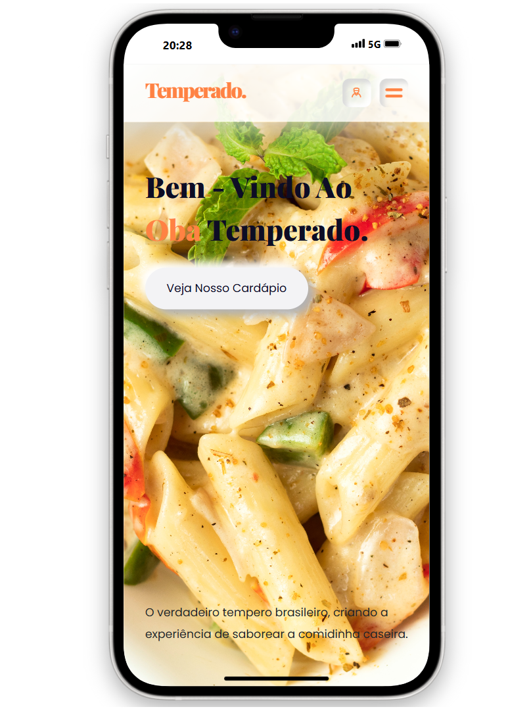

# Oba Temperado - Restaurante:

# Código fonte:
 - https://www.youtube.com/watch?v=ccNvJfonP3k
   
# Sites utilizados:
 - https://fontawesome.com/download
 - https://swiperjs.com/get-started  

# Color Palette:
 - https://mycolor.space

# Editor de Imagens Online:
 - https://www.resizepixel.com/pt/edit

# Imagens:
- https://www.freepik.com/
- https://www.storyset.com/
- https://www.undraw.com/
- https://www.pixabay.com/
- https://www.unsplash.com/
- https://www.flaticon.com/
- https://www.pngegg.com/

# Redes Sociais:
- https://www.instagram.com/trechosgame/
- https://www.behance.net/trechosgame
- https://github.com/trechosgame
- https://www.youtube.com/channel/UCfEsOEx_t6hiIms8HzttxOw/featured

